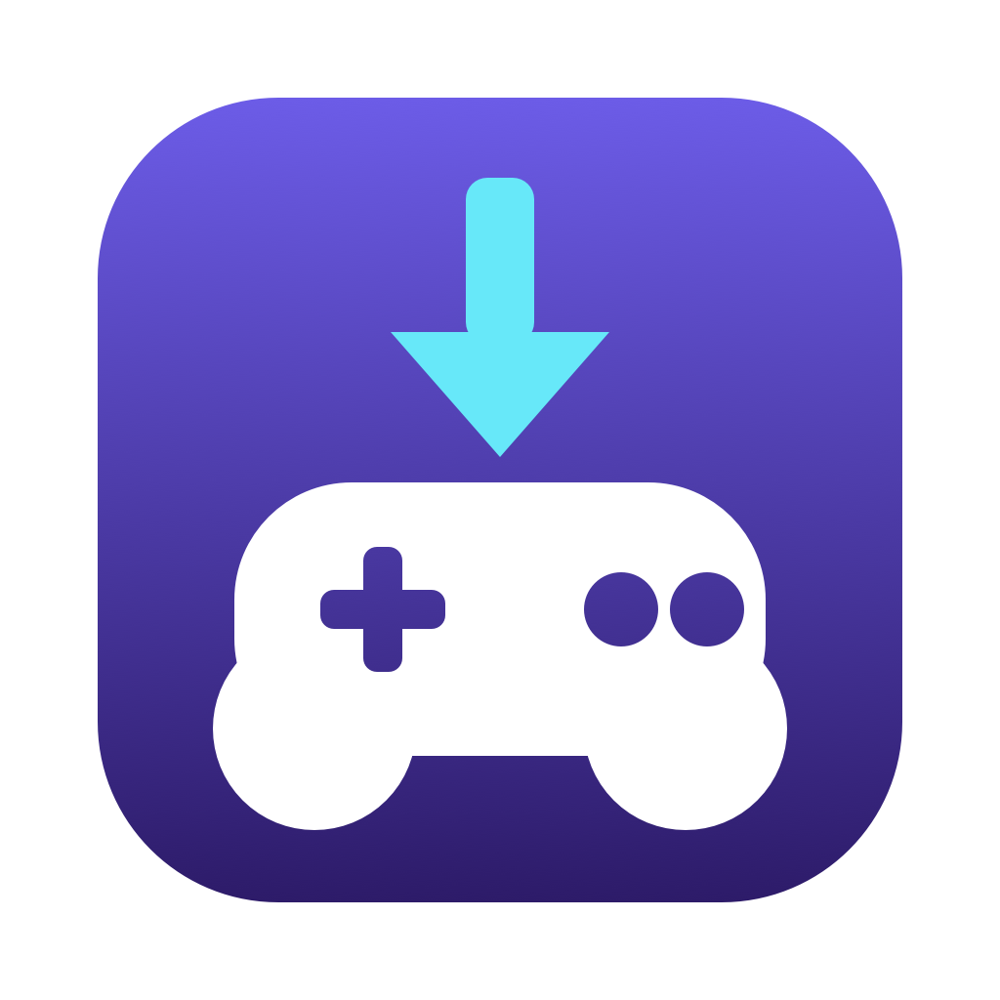

# MacroPort

Import Windows 8BitDo macro files (`.ini`) into the macOS app
**8BitDo Ultimate Software V2**.

## The problem

The Windows version of the 8BitDo software reads macros from a folder. You put
an `.ini` file there, and the macro appears in the app. The macOS version has no
such folder. It is sandboxed, so it cannot read a folder that you choose. It
keeps its macros inside its own preferences file, as JSON.

MacroPort reads the Windows file and writes the same macro into that
preferences file. The macro then appears in the 8BitDo app, and you load it to
the controller in the normal way.

## What it does

- Reads one or more `.ini` macro files.
- Shows every step before you import: hold time, buttons, both sticks, trigger.
- Shows the macros that the app already holds, with the same step table.
- Writes the macros into the profile that you choose.
- Copies the preferences file before every write.

## Requirements

- macOS 14 or later
- Xcode command line tools, for `swift build`
- 8BitDo Ultimate Software V2

Tested with macOS 26.6, Swift 6.4, 8BitDo Ultimate Software V2 1.0.17, and an
8BitDo Pro 3 controller.

## Build

```
git clone https://github.com/<user>/MacroPort.git
cd MacroPort
./build.sh          # build build/MacroPort.app
./build.sh --run    # build it, then open it
```

`build.sh` signs the app with an ad hoc signature. The app is not sandboxed,
because it must read and write the preferences file of another app. It needs no
Full Disk Access, because macOS does not protect the container of a third party
app.

## Import a macro

1. Quit 8BitDo Ultimate Software V2. The app overwrites its preferences when it
   exits, so it would discard the import.
2. Drop one or more `.ini` files on the window, or press Command-O.
3. Click a file to read its steps.
4. Press Import.
5. Start the 8BitDo app, open the Macro screen, then press "Load to Profile".
6. Press the Profile button on the controller to activate the profile.

The macro name comes from the file name. The limit is 16 characters.
Each profile holds 4 macros.

## View the macros that are already saved

The sidebar has two sections. "To import" lists the files that you dropped.
"Already in Pro3Macro_0" lists the macros that the app holds for the profile in
the toolbar. Click any row to read its steps. The list keeps itself current, so
a change that you make in the 8BitDo app appears within two seconds.

A saved macro shows no "Uniform time" row, because the app does not store that
setting.

## Guards

| Condition | Result |
|---|---|
| The 8BitDo app is open | Import is off, the toolbar shows a warning |
| A file that is not a macro | The file is listed with the reason, and it is skipped |
| A name that already exists | Import is off until you turn on Replace |
| More than 4 macros for a profile | Import is off, with the count to remove |
| A name longer than 16 characters | Import is off, with the name to change |
| A write fails part way | The preferences file stays untouched |

## Undo

Every write first copies the preferences file to
`~/Library/Application Support/MacroPort/Backups`. The File menu opens that
folder. To undo:

1. Quit the 8BitDo app.
2. Copy a backup over
   `~/Library/Containers/com.8BitDo.UltimateV2/Data/Library/Preferences/com.8BitDo.UltimateV2.plist`.
3. Run `killall cfprefsd`.

## The file format

The `.ini` file is not text. It is a binary dump of the same structure that the
macOS app stores as JSON. All values are little endian.

Header, 12 bytes. The names come from the Windows UI:

| Offset | Type | Field | Meaning |
|---|---|---|---|
| 0 | u16 | `uniformMs` | the value next to "Use uniform interval time" |
| 2 | u16 | `uniformOn` | the checkbox for that value, 0 means off |
| 4 | u32 | `cyclesNum` | 0xFFFFFFFF means "Repeated" |
| 8 | u32 | `intervalMs` | the "Interval" field, the gap between repeats |

Step, 10 bytes, one for each macro step:

| Offset | Type | Field | Meaning |
|---|---|---|---|
| 0 | u16 | `msTimes` | hold time in milliseconds |
| 2 | u16 | `keys` | button bitmask |
| 4 | u16 | `triggerValue` | trigger position |
| 6 | u16 | `leftJoy` | low byte X, high byte Y, 0x7F is centre |
| 8 | u16 | `rightJoy` | low byte X, high byte Y, 0x7F is centre |

The step list ends at the first step whose ten bytes are all zero. A press and
its release are two steps: the release repeats the step with the bit cleared.

The macOS app keeps the same fields in

```
~/Library/Containers/com.8BitDo.UltimateV2/Data/Library/Preferences/com.8BitDo.UltimateV2.plist
```

under a key such as `Pro3Macro_0`, where `0` is the profile number. The value is
UTF-8 JSON in a binary plist data field. A macro name is 32 bytes of UTF-16, big
endian, zero padded.

MacroPort writes only the macro list. It does not touch `Pro3CacheManager_0`,
which holds the copy that matches the controller. The 8BitDo app rebuilds that
copy when you press "Load to Profile".

## What is not known yet

- **Most button bits.** Three are confirmed against the Windows UI: `0x0400` is
  L, `0x1000` is B, `0x2000` is A. The app shows any other bit as hex. This
  affects the printed name only, because MacroPort copies the mask without
  change.
- **Other controllers.** The format was read from files for the 8BitDo Pro 3.
  The profile list comes from the preferences file, so a key for another
  controller appears once that controller has a macro. The step array of that
  controller may use other fields.

A pull request that confirms more bits, or another controller, is welcome.

## Layout

```
Sources/MacroPort/
  MacroFile.swift     the decoder and the button names
  Preferences.swift   the plist reader and writer, the guards, the backups
  Model.swift         the window state, the actions, the preview model
  ContentView.swift   the sidebar, the preview table, the banners
  MacroPortApp.swift  the app and its menu commands
Scripts/
  make-icon.swift     draws Resources/AppIcon.icns
Resources/
  AppIcon.icns        the app icon, which build.sh copies into the bundle
```

To change the icon, edit `Scripts/make-icon.swift`, then run
`swift Scripts/make-icon.swift`.

## Notice

MacroPort is not an official 8BitDo product. It is not affiliated with,
authorised by, or endorsed by Shenzhen 8BitDo Technology. "8BitDo" and the
product names are the trademarks of their owners, and this project uses them
only to say which software and which hardware it works with.

The repository holds no 8BitDo code and no 8BitDo assets. The file format above
comes from reading macro files and the preferences file of the macOS app.

MacroPort changes the preferences file of another app. It copies that file
before every write, but you use it at your own risk.

## License

MIT. See [LICENSE](LICENSE).
